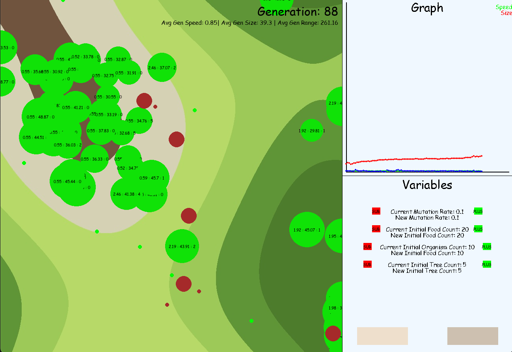
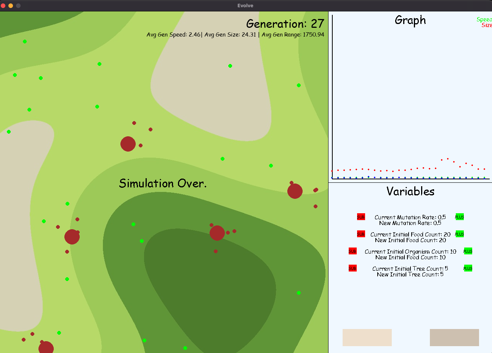
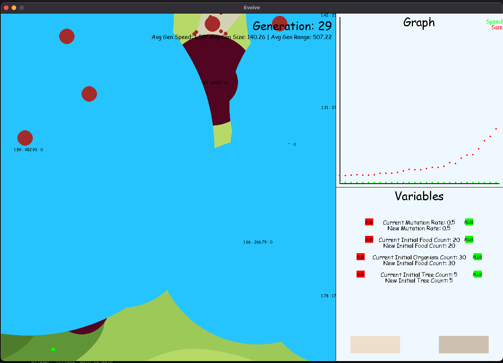

# Evolve: Simulating Evolution through Neural Networks

Created by: Alip Arslan ([aliparslan](https://github.com/aliparslan)), Emil Diaz ([emildiaz](https://github.com/emildiaz)), and Neil Phan ([neil-phan](https://github.com/neil-phan))

## Background and Motivations

As a final project for UVA's Computational Biology course, our group sought to explore ecological dynamics of evolution
and natural selection in a simulated environment.

The simulation consists of organisms, trees (red blobs), random terrain, and food.  Upon generation of the simualation,
a set number of organisms are created, each with varying levels of size, speed, and food vision range.  Within a generation,
these organisms are free to move about and collect as much food as possible.  They must eat at least one food to survive to
the next generation, and any further consumption will lead to reproduction of that organism.  During reproduction, the organism
passes on its traits to its offsprings with a set mutation rate multiplier.  

The organisms start off moving randomly, but through the work of neural network learning, will eventually become
purposeful in their movement--moving towards food.  This may take many generations.

The trends of the population are tracked after each generation in the graph.  Through this, we are able to make conclusions
about the advantageous traits that the environment selects for in the organisms.

## Installing Modules
```
pip3 install -r requirements.txt
```

## Usage
```bash
cd src
python3 graphics.py
```

## UI
The variables at the bottom right of the GUI allow the user to customize the starting variables for the simulation.  However,
these changes will not take into effect until after a new simulation is started.  This can be done by pressing the button
on the bottom left of this panel.  The button on the bottom right will pause the simulation.

## Example Simulations






## Possible Features in the Future
In the amount of time we had for the project, our group wasn't able to fully implement all the features we had in mind. This is something we may work on in the future, and many of them are already partially completed in the code. Here is a list of features we may work on:
  * More inputs and outputs for organism neural networks (thirst, metabolism, other tradeoffs in ecology)
  * More complex interactions between organisms
  * Predator-prey relations
  * Slider to speed up progression of generations
  * Greater complexity to reproduction (expanding beyond asexual)
  * Giving an evolution structure to trees (which will lead to plant-herbivore trends)
  * More complex terrain generation (going beyond the current noise functions) with bodies of water

